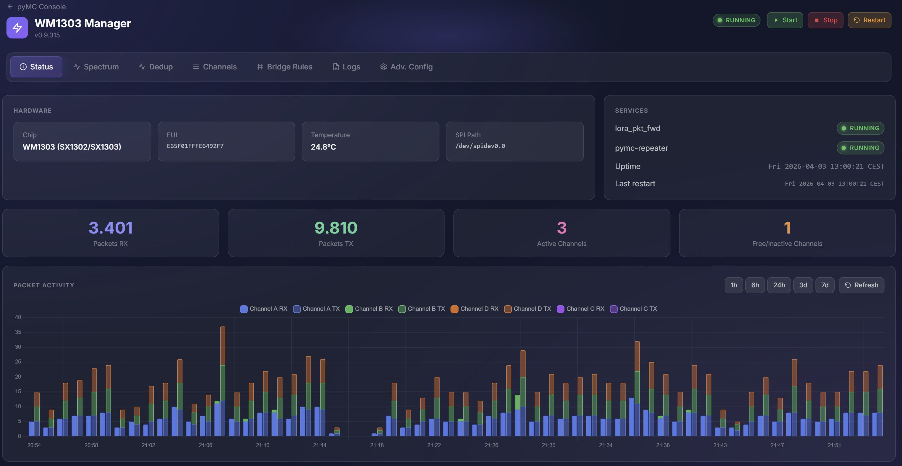
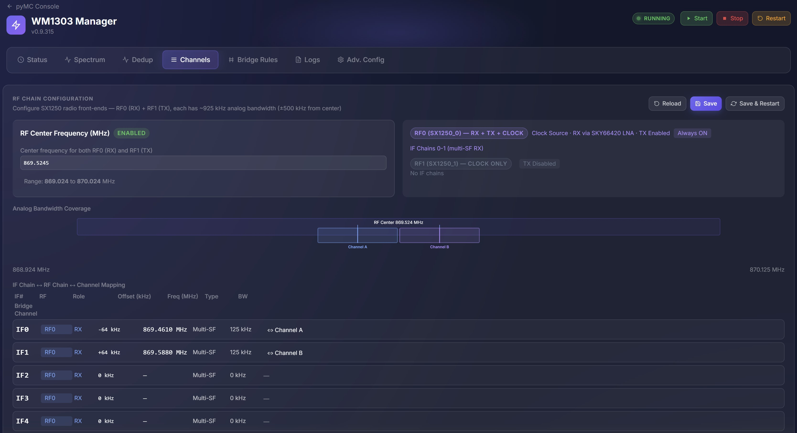
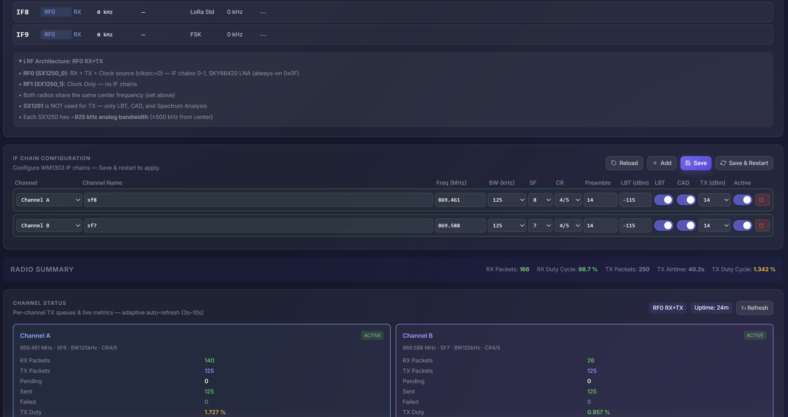
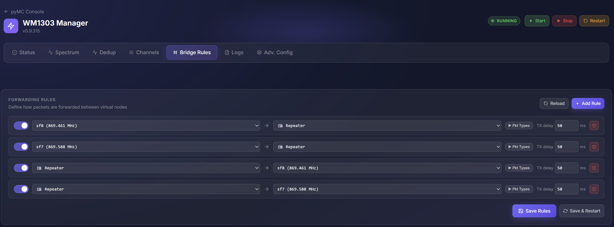
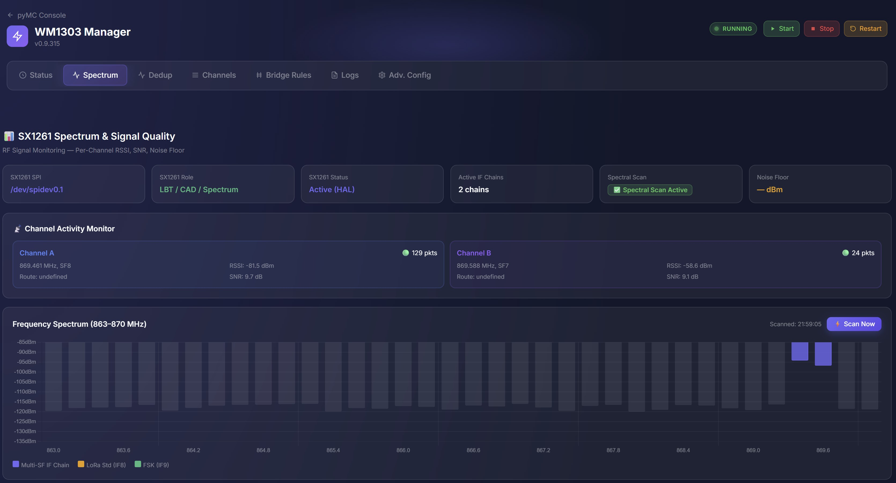
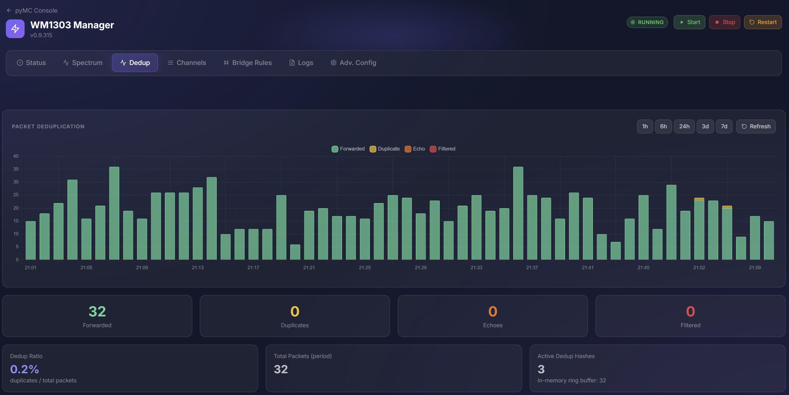

# pyMC_WM1303

**WM1303 (SX1302/SX1303) LoRa Concentrator Module for MeshCore**

A complete installation and management system for running a [WM1303 LoRa concentrator](https://www.seeedstudio.com/WM1303-LoRaWAN-Gateway-Module-SX1303-p-5154.html) with [MeshCore](https://meshcore.co) ([pyMC_core](https://github.com/rightup/pyMC_core) & [pyMC_Repeater](https://github.com/rightup/pyMC_Repeater)) on a SenseCAP M1 / Raspberry Pi.



---

## Overview

This project integrates the Semtech SX1302/SX1303-based WM1303 LoRa concentrator HAT with the MeshCore mesh networking stack, providing:

- **Multi-channel LoRa gateway** — Up to 4 simultaneous receive channels across 2 RF chains
- **MeshCore mesh repeater** — Bridge packets between channels, forward across the mesh network
- **Web-based management UI** — Real-time monitoring, channel configuration, spectrum analysis, noise floor tracking
- **REST API** — Full programmatic control of all gateway functions
- **Automated installation** — Single-script setup from bare Raspberry Pi OS
- **Version tracking** — Semantic versioning displayed in UI, tracked across installs and upgrades

The system uses an **overlay approach**: unmodified forks of the upstream repositories are cloned during installation, then WM1303-specific modifications are applied on top. This keeps the forks clean while allowing custom hardware integration.

## Features

### Radio & Hardware
- Dual RF chain support (RF0 + RF1) with independent frequency and spreading factor configuration
- Up to 8 IF demodulators (4 per RF chain) for multi-SF reception
- SX1261 companion chip integration for spectral scanning, noise floor monitoring, and **hardware CAD** (preamble correlation)
- Dynamic spectral scan range — automatically follows RF chain center frequency (±800 kHz)
- Spectral scan retry mechanism — waits for TX-free windows, zero TX overhead (0% vs 13% with old TX hold approach)
- Hardware + Software LBT/CAD (Listen Before Talk / Channel Activity Detection) per channel with HW/SW source tracking
- IF range validation (±730 kHz) with graceful degradation — out-of-range channels auto-disabled with warnings
- GPIO-based hardware control (power, reset, SX1261, AD5338R) with configurable pin mapping via UI
- Automatic AGC management with debounce protection
- FEM (Front-End Module) LNA/PA register management

### Software
- Fully async TX architecture (asyncio-native, no threading) with UDP socket auto-recovery
- Bridge engine with configurable rules (Single Source of Truth) for inter-channel packet forwarding
- Fair round-robin TX scheduler with per-channel HW/SW CAD counters and batch windows
- Dynamic TX hold — scales with queue depth: 0 pending = 0 ms, 1 pending = 100 ms, 2+ pending = 0 ms
- RX watchdog with 3 automatic detection modes and packet forwarder recovery
- Packet deduplication with configurable TTL
- Noise floor estimation with 3-tier fallback: spectral scan → LBT RSSI → RX packet estimation (RSSI-SNR)
- ADVERT neighbor tracking with packet logging to SQLite
- Automatic mesh `identity_key` generation on install/upgrade
- SQLite database for metrics, signal quality history, noise floor history, CAD events, and dashboard data
- TX echo detection — automatically filters unrealistic RSSI values (> -50 dBm)
- Safe file write handling — prevents data corruption from permission errors or unexpected failures
- JWT-based authentication for API and web interface
- Systemd service with security hardening and auto-restart
- Semantic version tracking via `/etc/pymc_repeater/version` and REST API
- One-line install and upgrade via bootstrap scripts
- NTP synchronization verification during installation

### Management Interface
- **WM1303 Manager** — Single-page web application at `http://<pi-ip>:8000/wm1303.html`
- **Status tab** — Service health (lora_pkt_fwd + pymc-repeater), packet activity chart, per-channel summary cards with live RX/TX counts, RSSI, SNR, noise floor, and uptime
- **Channels tab** — Per-channel configuration (frequency, SF, bandwidth), CAD/LBT dependency management, IF chain visualization
- **Spectrum tab** — Real-time SX1261 spectral scan, signal quality (RSSI/SNR) charts, noise floor per channel with color coding, CAD activity timeline (HW/SW), LBT history
- **Bridge tab** — Visual bridge rule editor for inter-channel and repeater forwarding with packet type filtering
- **Dedup tab** — Packet deduplication event log with hash, timestamps, and source/target channels
- **Logs tab** — Live service log viewer
- **Advanced Config** — GPIO pin mapping, IF chain parameters, RF chain settings, noise floor monitor configuration

## Hardware Requirements

| Component | Specification |
|-----------|---------------|
| **Single Board Computer** | SenseCAP M1 or Raspberry Pi 3B+/4/5 |
| **LoRa Module** | WM1303 LoRaWAN Gateway Module (SX1302/SX1303 + SX1261 + dual SX1250) |
| **HAT/Interface** | SenseCAP M1 Pi HAT or compatible SPI interface |
| **OS** | Raspberry Pi OS Lite (64-bit preferred, Bookworm or newer) |
| **SPI / I2C** | Enabled automatically by install script |
| **Internet** | Required during installation for package downloads |

## Quick Start

### 1. Prepare Raspberry Pi

1. Flash **Raspberry Pi OS Lite** (64-bit preferred, Bookworm or newer) onto your SD card using [Raspberry Pi Imager](https://www.raspberrypi.com/software/)
2. Ensure the default **`pi`** user exists — the install script uses `/home/pi/` as the base directory
3. Boot the SenseCAP M1 or Raspberry Pi and connect via SSH
4. Ensure the WM1303 Pi HAT is properly seated on the GPIO header
5. Verify internet connectivity (`ping google.com`)

> 💡 **Note:** SPI and I2C are enabled automatically by the install script — no manual configuration needed.

### 2. Install

**One-line installer** (recommended):

```bash
curl -sSL https://raw.githubusercontent.com/HansvanMeer/pyMC_WM1303/main/bootstrap.sh | sudo bash
```

**Or manually**:

```bash
git clone https://github.com/HansvanMeer/pyMC_WM1303.git
cd pyMC_WM1303
sudo bash install.sh
```
The installation script handles everything:
- System package updates and build tool installation
- SPI and I2C configuration verification
- Repository cloning (HAL, pyMC_core, pyMC_Repeater)
- Overlay application (WM1303-specific modifications)
- HAL and packet forwarder compilation
- Python virtual environment setup
- Configuration file deployment
- Version tracking deployment
- GPIO reset script generation
- Systemd service installation and startup
- NTP synchronization verification

Verbose output is written to `/tmp/wm1303_install.log`. The console shows step summaries with ✓/✗ status indicators.

### 3. Setup Wizard

After installation, open the pyMC Repeater web interface:

```
http://<your-pi-ip>:8000
```

The setup wizard will guide you through the initial configuration. When prompted for hardware type, select **WM1303 LoRa Concentrator**.

> ⚠️ **Important:** The pyMC Repeater dashboard has a **Configure → Radio Settings** page. These radio settings are **NOT used** when running with the WM1303 concentrator. All radio configuration is managed exclusively through the **WM1303 Manager** interface (see next steps). You can safely ignore the Radio Settings page.

### 4. Configure Channels

Once the setup wizard is complete, open the **WM1303 Manager**:

```
http://<your-pi-ip>:8000/wm1303.html
```

Navigate to the **Channels** tab to configure your RF chains and channel assignments:



In the upper section you configure the **RF Chain** settings:
- **RF Center Frequency** — Set the center frequency for your RF chain (e.g., `869.5245 MHz` for EU868). Both SX1250 radios share this center frequency. Manual changes are preserved across restarts.
- The **Analog Bandwidth Coverage** visualization shows you exactly which frequencies your IF chains cover.

Scroll down to configure the **IF Chains** and **Channel Definitions**:



In the lower section:
- **IF Chain Configuration** — Maps IF demodulators to RF chains with frequency offsets. Each active IF chain becomes a receive slot.
- **Channel Definition Table** — Configure each channel with:
  - **Channel Name** — Friendly name (e.g., `sf8`, `sf7`)
  - **Frequency** — Exact RX/TX frequency in MHz
  - **Spreading Factor (SF)** — SF7 through SF12
  - **Bandwidth** — Typically 125 kHz
  - **Coding Rate** — Typically 4/5
  - **Preamble** — LoRa preamble length
  - **LBT / CAD** — Enable/disable Listen Before Talk and Channel Activity Detection per channel
  - **TX Power** — Transmit power in dBm
  - **Active** — Enable/disable the channel
- **Radio Summary** — Shows live RX/TX statistics including duty cycle
- **Channel Status** — Real-time per-channel metrics (RX/TX packets, pending, sent, failed, TX duty)

Click **Save & Restart** after making changes to apply the new channel configuration.

### 5. Configure Bridge Rules

Navigate to the **Bridge Rules** tab to define how packets are forwarded between channels:



Bridge rules define the **forwarding paths** between your channels and the MeshCore repeater:
- **Source → Target** — Each rule specifies a source (left) and a target (right)
- For a basic 2-channel repeater setup, create 4 rules:
  1. `SF8 (869.461 MHz)` → `Repeater` — Forward packets received on channel A to the mesh repeater
  2. `SF7 (869.588 MHz)` → `Repeater` — Forward packets received on channel B to the mesh repeater
  3. `Repeater` → `SF8 (869.461 MHz)` — Forward mesh repeater packets out on channel A
  4. `Repeater` → `SF7 (869.588 MHz)` — Forward mesh repeater packets out on channel B
- **Pkt Types** — Optionally filter which packet types are forwarded per rule
- **TX Delay** — Add a delay (in ms) before forwarding
- Use the **toggle** on each rule to enable/disable it

Click **Save & Restart** to activate the bridge rules.

### 6. Verify Operation

Go back to the **Status** tab to verify everything is running:
- Both services (`lora_pkt_fwd` and `pymc-repeater`) should show **RUNNING**
- The **Packet Activity** chart should start showing RX/TX activity
- Active channels should be counted in the summary cards

See [docs/installation.md](docs/installation.md) for detailed installation instructions and troubleshooting.

> 💡 **Tip:** After installation, do a **hard refresh** in your browser (`Ctrl + Shift + R` or `Cmd + Shift + R` on Mac) when opening the WM1303 Manager for the first time to ensure the latest UI is loaded.

## Upgrading

**One-line upgrade** (recommended):

```bash
curl -sSL https://raw.githubusercontent.com/HansvanMeer/pyMC_WM1303/main/upgrade_bootstrap.sh | sudo bash
```

**Or manually**:

```bash
cd pyMC_WM1303
git pull
sudo bash upgrade.sh
```

Options:
- `--rebuild` — Force HAL/packet forwarder rebuild
- `--force-config` — Overwrite existing configuration with templates
- `--skip-pull` — Skip pulling from fork repositories

The upgrade script:
- Automatically backs up your configuration and databases before making changes
- Smart-merges config files (adds missing keys without overwriting your settings)
- Runs database schema migrations (creates missing tables, adds new columns)
- Cleans up legacy data (old channel ID formats, TX echo entries)
- Detects HAL overlay changes via checksums and rebuilds only when needed
- Preserves all your channel settings, bridge rules, and metric history
- Backwards compatible with all previous installed versions

Verbose output is written to `/tmp/wm1303_upgrade.log`. The console shows step summaries with ✓/✗ status indicators.

> 💡 **Tip:** After upgrading, do a **hard refresh** in your browser (`Ctrl + Shift + R` or `Cmd + Shift + R` on Mac) to ensure the latest UI changes are loaded.

## WM1303 Manager UI

The WM1303 Manager is a single-page web application accessible at `http://<your-pi-ip>:8000/wm1303.html`. It provides real-time monitoring and configuration across multiple tabs:

### Status
Hardware overview, service health, packet activity charts, and active channel summary.


### Spectrum & Signal Quality
SX1261-based spectral scanning with dynamic frequency range, per-channel noise floor monitoring (global indicator + per-channel cards + historical graph), signal quality (RSSI/SNR) charts, and channel activity monitoring.



### Deduplication
Packet deduplication statistics showing forwarded, duplicate, echo, and filtered packets with historical charts.



### Channels
RF chain configuration, IF chain-to-channel mapping, per-channel settings, and live radio statistics.

See [Quick Start — Step 3](#3-configure-channels) above for details.

### Bridge Rules
Visual bridge rule editor for inter-channel packet forwarding.

See [Quick Start — Step 4](#4-configure-bridge-rules) above for details.

## Repository Structure

```
pyMC_WM1303/
├── install.sh              # Full installation script (12 phases)
├── upgrade.sh              # Upgrade script with smart config merge & DB migration
├── upgrade_bootstrap.sh    # One-line upgrade bootstrap
├── bootstrap.sh            # One-line install bootstrap
├── VERSION                 # Version tracking file
├── README.md               # This file
├── TODO.md                 # Development task tracking
├── LICENSE                 # MIT License
├── config/                 # Configuration templates
│   ├── config.yaml.template    # Main application config
│   ├── wm1303_ui.json          # UI & channel config (SSOT)
│   ├── global_conf.json        # HAL configuration
│   ├── pymc-repeater.service   # Systemd service file
│   ├── reset_lgw.sh            # GPIO reset script template
│   └── power_cycle_lgw.sh      # Power cycle script template
├── overlay/                # Source code modifications
│   ├── hal/                    # HAL & packet forwarder patches
│   │   ├── libloragw/          #   AGC, FEM, LNA, spectral scan
│   │   └── packet_forwarder/   #   TX/RX handling modifications
│   ├── pymc_core/              # MeshCore core library additions
│   │   └── hardware/           #   WM1303Backend, TXQueue, SX1261, etc.
│   └── pymc_repeater/          # MeshCore repeater modifications
│       └── repeater/           #   Bridge engine, API, UI, config
├── screenshots/            # UI screenshots
├── docs/                   # Comprehensive documentation
│   ├── architecture.md         # System architecture overview
│   ├── hardware.md             # Hardware & HAL details
│   ├── radio.md                # Radio configuration guide
│   ├── software.md             # Software components
│   ├── ui.md                   # WM1303 Manager UI guide
│   ├── api.md                  # REST API reference
│   ├── lbt_cad.md              # LBT & CAD documentation
│   ├── tx_queue.md             # TX queue & scheduling
│   ├── configuration.md        # Configuration file reference
│   ├── installation.md         # Installation & upgrade guide
│   └── repositories.md         # Repository information
└── scripts/                # Utility scripts
```

## Used Fork Repositories

This project uses unmodified forks of the upstream repositories. **Do not modify the forks directly** — all changes are managed through the overlay directory.

| Repository | Branch | Purpose |
|------------|--------|---------|
| [sx1302_hal](https://github.com/HansvanMeer/sx1302_hal) | `master` | Semtech HAL v2.10 for SX1302/SX1303 |
| [pyMC_core](https://github.com/HansvanMeer/pyMC_core) | `dev` | MeshCore core library (radio drivers, mesh protocol) |
| [pyMC_Repeater](https://github.com/HansvanMeer/pyMC_Repeater) | `dev` | MeshCore repeater (bridge, web UI, API, service) |

See [docs/repositories.md](docs/repositories.md) for details on the overlay approach.

## Documentation

| Document | Description |
|----------|-------------|
| [Architecture](docs/architecture.md) | System architecture, component relationships, data flow |
| [Hardware](docs/hardware.md) | WM1303 module, SPI, GPIO, HAL modifications, FEM/LNA/AGC |
| [Radio](docs/radio.md) | RF/IF chains, channels, frequency planning, sync word |
| [Software](docs/software.md) | Backend components, bridge engine, watchdog, database |
| [UI Guide](docs/ui.md) | WM1303 Manager web interface |
| [API Reference](docs/api.md) | REST API endpoints and authentication |
| [LBT & CAD](docs/lbt_cad.md) | Listen Before Talk and Channel Activity Detection |
| [TX Queue](docs/tx_queue.md) | TX processing flow, queue management, scheduling |
| [Configuration](docs/configuration.md) | All configuration files explained |
| [Installation](docs/installation.md) | Installation, upgrade, and troubleshooting guide |
| [Repositories](docs/repositories.md) | Fork repos, branches, and overlay approach |

## Technology Stack

| Layer | Technology |
|-------|------------|
| **Hardware Abstraction** | C (Semtech HAL v2.10, libloragw, lora_pkt_fwd) |
| **Backend** | Python 3 (pyMC_core, pyMC_Repeater, CherryPy) |
| **Frontend** | HTML5, JavaScript, CSS (single-page application) |
| **Charts** | Chart.js with chartjs-adapter-date-fns |
| **Database** | SQLite (metrics, signal history, dedup events) |
| **Service** | systemd (pymc-repeater.service) |
| **Communication** | SPI (HAL ↔ SX1302), UDP (pkt_fwd ↔ backend), WebSocket (backend ↔ UI) |

## Service Management

```bash
# Start / stop / restart
sudo systemctl start pymc-repeater
sudo systemctl stop pymc-repeater
sudo systemctl restart pymc-repeater

# View logs
journalctl -u pymc-repeater -f

# Check status
sudo systemctl status pymc-repeater
```

## Disclaimer

> **⚠️ Use at your own risk.** This software interacts directly with radio hardware via SPI and GPIO.
> I'm not taking any responsibility for any damage to hardware, loss of data, or regulatory
> non-compliance resulting from the use of this software. Ensure your radio configuration complies
> with local regulations (e.g., EU868 duty cycle limits).

## License

This project is licensed under the MIT License — see the [LICENSE](LICENSE) file for details.
