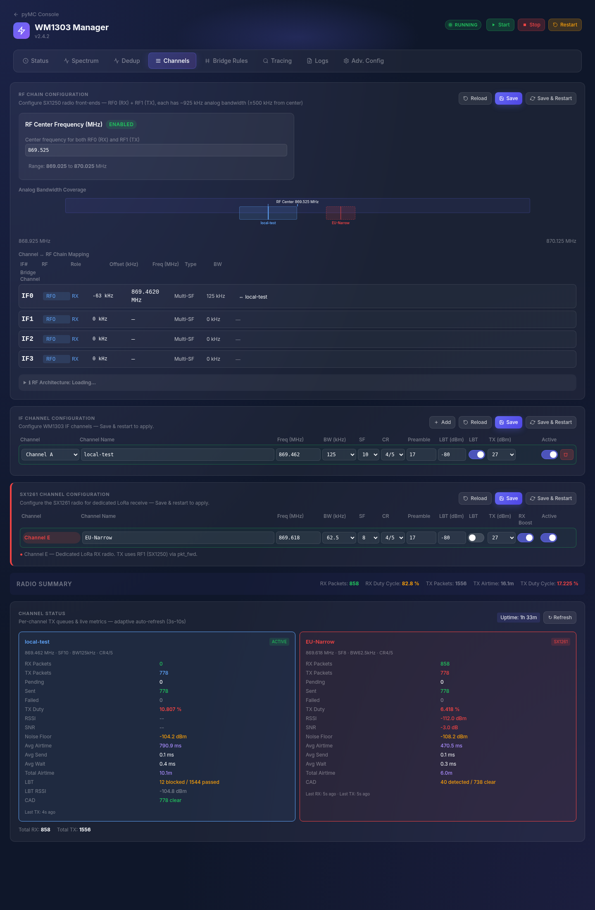
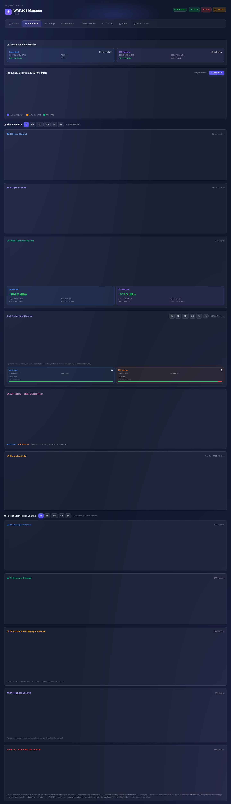
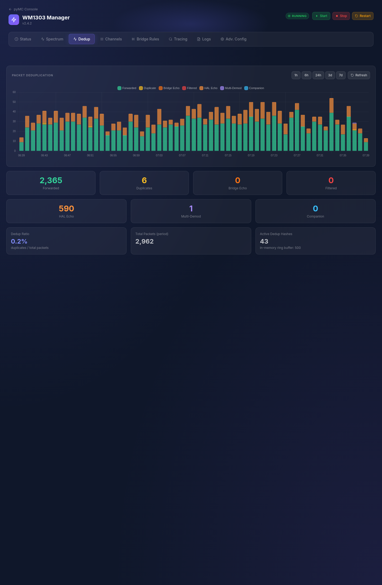
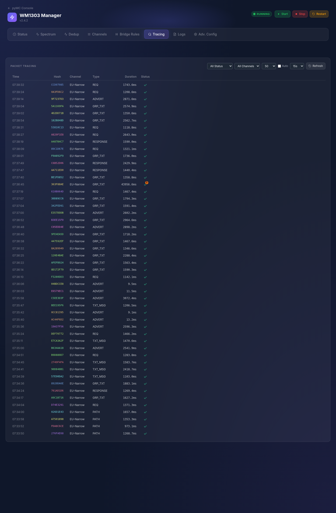

# pyMC WM1303 — LoRa Multi-Channel Bridge/Repeater

> **⚠️ This is a fork of [HansvanMeer/pyMC_WM1303](https://github.com/HansvanMeer/pyMC_WM1303).**
> Fork maintained by [@fahimshariff-au](https://github.com/fahimshariff-au).
> This fork targets **Australian 915–928 MHz ISM band hardware** (AU915 Mid — 915.075 MHz, SF9, BW125kHz) and includes bug fixes and AU-specific modifications on top of the upstream codebase.
> See [FORK_NOTES.md](FORK_NOTES.md) for the full modification log and [AU915_SETUP.md](AU915_SETUP.md) for the AU915 Mid frequency rationale and setup guide.

---

A multi-channel LoRa bridge and repeater that turns an SX1302/SX1303-based concentrator into a **MeshCore multi-channel radio gateway**. It receives, deduplicates, and retransmits packets across up to 6 independent LoRa channels — each with its own frequency, bandwidth, spreading factor, coding rate, and TX power — enabling MeshCore nodes on different channels to communicate through a single device.

Built on top of [pyMC_core](https://github.com/HansvanMeer/pyMC_core) (dev) and [pyMC_Repeater](https://github.com/HansvanMeer/pyMC_Repeater) (dev), this project adds the WM1303-specific backend, bridge engine, web management UI, and all HAL-level modifications needed to run the concentrator as a multi-channel MeshCore repeater.

> **Currently tested on the SenseCAP M1** (Raspberry Pi 4 + WM1302/WM1303 HAT).  
> In principle, it should work with **any SX1302/SX1303 concentrator module that includes an onboard SX1261 or SX1262** radio.  
> A future goal is to validate and support additional hardware platforms.

---

## Hardware Compatibility

This project targets Raspberry Pi–based systems with an SX1302 or SX1303 concentrator that has an onboard SX1261 or SX1262 radio. The following devices have been tested or are expected to be compatible:

| Device | Status | Notes |
|--------|--------|-------|
| **SenseCAP M1** | ✅ Tested | Raspberry Pi 4 with built-in PiHAT and WM1302/WM1303 module |
| **Raspberry Pi 4 + Seeed PiHAT + WM1302** | 🔜 Testing soon | Standalone Pi 4 with separate Seeed WM1302 (incl. SX1262) HAT |
| **RAK5146 (SPI variant)** | ⬜ Not yet tested | SX1303 + SX1261 on mPCIe — requires mPCIe-to-Pi adapter; SPI interface, minimal HAL pin-mapping changes expected |
| **RAK5166** | ⬜ Not yet tested | SX1303 + SX126X on M.2 3042 — USB interface (STM32 bridge), requires HAL adaptation for USB mode |
| **RAK Hotspot Miner V2** | ❌ Incompatible | Uses RAK2287 internally (no SX1261/SX1262) — see below |
| **Other SX1302/SX1303 Pi HATs** | ⬜ Not yet tested | Any Raspberry Pi (3B+, 4, 5) with a compatible concentrator HAT — the module **must** include an integrated SX1261 or SX1262 (see warning below) |

> ❌ **Known incompatible:** The **RAK2287** does NOT include an SX1261/SX1262 (only SX1302 + 2× SX1250). Despite having reserved SX1261 pins on its mPCIe connector, the chip is not populated. This module **cannot** be used with this project. All RAK Hotspot Miners (V1, V2, Lite) use the RAK2287 or older RAK2245 — none include an SX1261/SX1262.

> ⚠️ **The SX1261/SX1262 is a hard requirement.** This system relies on the SX1261/SX1262 for mandatory hardware CAD before every transmission, which is deeply integrated into the entire TX pipeline. Without it, the system **will not function**. Other essential features like LBT, spectral scanning, noise floor monitoring, and Channel E also depend on this radio. Always verify your concentrator module includes an onboard SX1261 or SX1262 before attempting installation.


## Key Features

### Radio & Channels
- **6 simultaneous LoRa channels** — 4 multi-SF channels via the SX1302 concentrator (A–D), 1 single-SF channel via the onboard SX1261 (E), and 1 single-SF wideband channel via the SX1302 `chan_Lora_std` demodulator (F)
- **Per-channel radio configuration** — independently set frequency, bandwidth, spreading factor (SF), coding rate (CR), TX power, and preamble length for each channel
- **Channel E (SX1261)** — full RX/TX on the onboard SX1261 radio, supporting BW62.5 / BW125 / BW250 / BW500 and SF5–SF12
- **Channel F (SX1302 `chan_Lora_std`)** — wideband single-SF channel supporting BW125 / BW250 / BW500 and SF5–SF12, runs in parallel with Channels A–D on the same SX1302 chip without interference
- **Multi-region support** — 8 regional presets (EU868, US915, AU915, AS923, IN865, JP920, KR920) plus CUSTOM, with per-region TX bounds and SX1261 image calibration
- **Bridge engine independence** — Channel E and F work fully independently from Channels A–D; users can disable all A–D channels and operate exclusively with E and/or F

### Collision Avoidance
- **Hardware CAD (Channel Activity Detection)** — SX1261-based hardware CAD scan before every TX, implemented in C for minimal latency. Replaces the traditional MeshCore airtime × delay factor method with a more efficient and reliable mechanism for collision avoidance
- **HAL-level LBT (Listen Before Talk)** — AGC-based RSSI measurement per channel with user-configurable threshold. Independently enable/disable LBT per channel via the UI
- **CAD calibration engine** — per-SF CAD parameter tuning (det_peak, det_min) via API, enabling fine-tuning of detection sensitivity per spreading factor

### TX Pipeline
- **Per-channel TX queues** — dedicated FIFO queue per channel with configurable TTL and overflow management
- **Fair round-robin scheduling** — the global TX scheduler cycles through all channel queues fairly
- **Origin-channel-first TX priority** — repeated packets are sent to the originating channel first, then to other targets
- **Direct-send mode** — bypasses the JIT timing queue for minimum TX latency
- **TX hold (RX batch window)** — configurable delay after RX to collect related packets before starting TX, maximizing RX availability

### Deduplication
- **3-layer deduplication** — self-echo suppression, multi-demodulator duplicate filtering, and cross-channel hash dedup across all active channels

### Bridge Engine
- **Advanced bridge rules** — flexible rule-based packet routing between channels with per-rule packet type filtering (SSOT model)

### Monitoring & Diagnostics
- **Spectrum insights with up to 8 days retention** — historical charts for RSSI, SNR, noise floor, CAD checks, LBT measurements, RX and TX activity per channel
- **Continuous noise floor monitoring** — derived from LBT RSSI, spectral scan, and RX signal data per channel, without pausing TX or RX
- **CRC error tracking** — per-channel per-minute CRC error rate monitoring with historical data
- **Detailed packet tracing** — step-by-step trace of every packet through the entire pipeline (RX → dedup → bridge rules → TX queue → CAD/LBT → TX), with path-based echo classification (self/mesh/unknown)

### Reliability & Self-Healing
- **HAL recovery & escalation** — automatic SX1302 correlator reinit, SX1261 recovery, and process respawn when hardware anomalies are detected
- **AGC periodic reload** — prevents SX1302 correlator stall by periodically refreshing the AGC configuration
- **Spectral scan self-recovery** — automatic SX1261 reinit when the spectral scan thread detects stuck or timeout conditions

### Management
- **Web management UI** — real-time status dashboard, channel configuration, bridge rules editor, spectrum charts, dedup visualization, and packet trace viewer
- **REST API + WebSocket** — full programmatic control with real-time event streaming
- **SSOT configuration** — single source of truth model for all settings (`wm1303_ui.json`)
- **Installation wizard** — interactive region, channel preset, and sync_word selection during install, with environment variable overrides for automated deployments

### Infrastructure
- **One-command install** — automated installation and upgrade via a single bootstrap command
- **Optimized for Raspberry Pi** — SPI bus stability tuning (4 MHz clock, 16 KB burst transfers, CPU governor pinning, RT scheduling for SPI thread), memory-efficient SQLite storage, systemd service integration
- **SQLite database logging** — persistent storage for metrics, packets, noise floor history, CRC errors, and spectrum data
- **Automatic metrics retention** — configurable cleanup (default 8 days) with tiered downsampling (Hot/Warm/Cool/Cold) for consistent long-term visibility

## 6-Channel Architecture

| Channel | Radio | Bandwidth | SF | Mode |
|---------|-------|-----------|----|------|
| **A** | SX1302 `multiSF_0` | 125 kHz | SF5–SF12 simultaneous | Multi-SF |
| **B** | SX1302 `multiSF_1` | 125 kHz | SF5–SF12 simultaneous | Multi-SF |
| **C** | SX1302 `multiSF_2` | 125 kHz | SF5–SF12 simultaneous | Multi-SF |
| **D** | SX1302 `multiSF_3` | 125 kHz | SF5–SF12 simultaneous | Multi-SF |
| **E** | SX1261 | 62.5 / 125 / 250 / 500 kHz | SF5–SF12 (one at a time) | Single-SF |
| **F** | SX1302 `Lora_std` | 125 / 250 / 500 kHz | SF5–SF12 (one at a time) | Single-SF |

**Key differences:**
- **Channels A–D** use the SX1302 multi-SF demodulators: they receive **all spreading factors simultaneously** on a fixed 125 kHz bandwidth. No SF selection is needed.
- **Channel E** uses the SX1261 companion radio: a dedicated transceiver with **full bandwidth flexibility** (62.5–500 kHz) and **single-SF** operation (one SF selected at a time).
- **Channel F** uses the SX1302's `chan_Lora_std` demodulator slot: a **single-SF wideband** channel that runs **in parallel** with Channels A–D on the same SX1302 chip — no interference, no IF-chain contention. Supports BW125/250/500.
- **Channels A–D** can be fully disabled while Channel E and/or F continue to operate independently.

> **Tip:** Fewer active channels = more stable operation. 4 channels maximum is recommended.

## Quick Start

### Prerequisites

- SenseCAP M1 (or Raspberry Pi 4 with WM1302/WM1303 HAT)
- Raspberry Pi OS Lite (Bookworm or newer)
- SSH access and internet connectivity

### Install or Upgrade

A single command handles both fresh installations and upgrades — the script automatically detects which is needed:

```bash
curl -sSL https://raw.githubusercontent.com/HansvanMeer/pyMC_WM1303/main/bootstrap.sh | sudo bash
```

- **New system** → clones the repository and runs a full installation (15–30 minutes)
- **Existing installation** → pulls the latest changes and runs an incremental upgrade

The script handles system updates, dependencies, HAL compilation, Python setup, and service configuration.

> ⚠️ **After every upgrade**, perform a hard refresh in your browser to load the updated UI:  
> **Ctrl+Shift+R** or **Ctrl+F5** on `http://<pi-ip>:8000/wm1303.html`

### Access the UI

```
http://<pi-ip>:8000/wm1303.html
```

## ⚠️ Channel Count & LoRa Settings Impact

Every received message that matches a bridge rule is **retransmitted on each target channel, one at a time**. More active channels and slower LoRa settings directly increase the total TX time per message — and while transmitting, the radio **cannot receive**.

### How TX time adds up

The TX scheduler uses fair round-robin: each channel transmits in sequence. The total TX time is the **sum** of all channel airtimes:

```
  Message received on Channel A → forwarded to B, C, E, F

  Time ──────────────────────────────────────────────────────────────────────────►

  ┌─ RX ─┐┌── TX Ch.B ──┐┌── TX Ch.C ──┐┌──── TX Ch.E ────┐┌── TX Ch.F ──┐┌─ RX ───┐
  │listen ││  183 ms     ││  183 ms     ││    366 ms       ││  92 ms      ││listen │
  └───────┘└─────────────┘└─────────────┘└─────────────────┘└─────────────┘└───────┘
           ├──────────────── Total TX: 824 ms ──────────────────────────────┤
                          NO RX possible during this window
```

With slower LoRa settings, the same message takes **much** longer:

```
  Same message, but all channels set to BW125/SF10/CR8:

  Time ──────────────────────────────────────────────────────────────────────────────────────────────────────►

  ┌─ RX ─┐┌─────── TX Ch.B ───────┐┌─────── TX Ch.C ───────┐┌──────── TX Ch.E ────────┐┌────── TX Ch.F ──────┐┌─ RX ──┐
  │listen ││       920 ms          ││       920 ms          ││       1051 ms          ││      920 ms        ││listen │
  └───────┘└───────────────────────┘└───────────────────────┘└────────────────────────┘└────────────────────┘└───────┘
           ├──────────────────────────── Total TX: 3.8 seconds ────────────────────────────────────────────┤
                                     RX blocked 4× longer than fast settings!
```

### Airtime comparison (50-byte packet)

| LoRa Settings | Airtime | Relative |
|---------------|--------:|---------:|
| BW250 / SF8 / CR5 | **92 ms** | 0.5× |
| BW125 / SF8 / CR5 | **183 ms** | 1.0× |
| BW125 / SF9 / CR5 | 345 ms | 1.9× |
| BW62.5 / SF8 / CR5 | 366 ms | 2.0× |
| BW125 / SF10 / CR5 | 649 ms | 3.6× |
| BW125 / SF10 / CR8 | 920 ms | **5.0×** |
| BW125 / SF11 / CR5 | 1,380 ms | 7.6× |
| BW500 / SF12 / CR5 | 854 ms | 4.7× |
| BW125 / SF12 / CR8 | 3,416 ms | **18.7×** |

> A single packet on SF12/CR8 takes as long as **19 packets** on SF8/CR5!
> Using BW250 or BW500 (Channel E or F) can cut airtime by 50–75%.

### RX availability per message (1 message every 10 seconds)

| Channels | Fast (BW125/SF8/CR5) | Medium (BW62.5/SF8/CR5) | Slow (BW125/SF10/CR8) |
|---------:|---------------------:|------------------------:|----------------------:|
| 2 | ✅ 96.3% | ✅ 92.7% | ⚠️ 81.6% |
| 3 | ✅ 94.5% | ✅ 89.0% | ⚠️ 72.4% |
| 5 | ✅ 90.9% | ⚠️ 81.7% | 🔴 54.0% |
| 6 | ✅ 89.0% | ⚠️ 78.0% | 🔴 44.8% |

> With 6 slow channels, the repeater spends **more than half its time transmitting** and may miss incoming messages.

### Recommendations

| Guideline | Why |
|-----------|-----|
| **Use 2–3 channels** for best reliability | Keeps TX time short, maximizes RX availability |
| **Prefer faster settings** (lower SF, higher BW) | Dramatically reduces airtime per packet |
| **Only add channels you actually need** | Each channel multiplies the TX time per message |
| **Match settings to range needs** | Use SF8 for nearby nodes, reserve SF10+ only for distant links |
| **Use Channel F (BW250/500) for fast links** | Wideband channels significantly reduce airtime |
| **Monitor TX queue stats** in the Status tab | If queues build up, your channels are too slow or too many |


## Screenshots

<table>
  <tr>
    <td align="center"><b>Status</b><br></td>
    <td align="center"><b>Channels</b><br></td>
    <td align="center"><b>Bridge Rules</b><br></td>
  </tr>
  <tr>
    <td align="center"><b>Spectrum</b><br></td>
    <td align="center"><b>Deduplication</b><br></td>
    <td align="center"><b>Tracing</b><br></td>
  </tr>
</table>

## Architecture Overview

```
┌──────────────────────────────────────────────────────┐
│  WM1303 HAT: SX1302 + 2× SX1250 + SX1261            │
└───────────────────────┬──────────────────────────────┘
                        │ SPI (/dev/spidev0.0 + 0.1)
┌───────────────────────┴──────────────────────────────┐
│  libloragw (HAL v2.10) + lora_pkt_fwd               │
│  ├── chan_multiSF_0..3 RX (Channels A–D, SF5–SF12)   │
│  ├── chan_Lora_std RX (Channel F, single-SF wideband) │
│  ├── SX1261 LoRa RX → UDP :1733 (Channel E)         │
│  ├── Spectral scan thread (SX1261)                   │
│  ├── HW CAD scan (SX1261, per-channel config)        │
│  └── HAL LBT (AGC-based, per-channel threshold)      │
└───────────────────────┬──────────────────────────────┘
                        │ UDP :1780/:1782
┌───────────────────────┴──────────────────────────────┐
│  WM1303 Backend                                      │
│  ├── VirtualLoRaRadio (per channel A–D)              │
│  ├── Channel E Bridge (SX1261 RX / SX1302 TX)        │
│  ├── Channel F Bridge (chan_Lora_std RX / SX1302 TX)  │
│  ├── NoiseFloorMonitor (LBT RSSI + RX-based)         │
│  └── 3-layer dedup (echo + multi-demod + hash)       │
├──────────────────────────────────────────────────────┤
│  Bridge Engine (operates independently of A–D)       │
│  ├── Rule-based routing (source → target)            │
│  ├── Packet type filtering                           │
│  └── TX hold (configurable RX batch window)          │
├──────────────────────────────────────────────────────┤
│  Per-Channel TX Queues (A–F)                         │
│  ├── Fair round-robin scheduling                     │
│  └── TTL + overflow management                       │
├──────────────────────────────────────────────────────┤
│  Data & Monitoring                                   │
│  ├── Packet trace (path-based echo classification)   │
│  ├── SQLite data acquisition + spectrum history      │
│  └── Metrics retention (tiered: Hot/Warm/Cool/Cold)  │
├──────────────────────────────────────────────────────┤
│  WM1303 Manager UI + REST API + WebSocket            │
└──────────────────────────────────────────────────────┘
```

## Documentation

| Document | Description |
|----------|-------------|
| [Architecture](docs/architecture.md) | System architecture, data flow, design principles |
| [Radio](docs/radio.md) | Radio topology, 6-channel model, RF chains |
| [Hardware](docs/hardware.md) | WM1303 HAT, SPI layout, GPIO, platform details |
| [Software](docs/software.md) | All software components and their roles |
| [Channel E / SX1261](docs/channel_e_sx1261.md) | Channel E and the SX1261 radio — full story |
| [Configuration](docs/configuration.md) | Config files, SSOT model |
| [TX Queue](docs/tx_queue.md) | TX queue architecture and scheduling |
| [LBT & CAD](docs/lbt_cad.md) | Listen Before Talk and Channel Activity Detection |
| [API Reference](docs/api.md) | REST API endpoints |
| [Manager UI](docs/ui.md) | Web management interface |
| [Installation](docs/installation.md) | Install and upgrade guide |
| [Repositories](docs/repositories.md) | Repository structure and overlay strategy |

## Related Repositories

| Repository | Purpose |
|-----------|--------|
| [HansvanMeer/sx1302_hal](https://github.com/HansvanMeer/sx1302_hal) | SX1302 HAL v2.10 (fork) |
| [HansvanMeer/pyMC_core](https://github.com/HansvanMeer/pyMC_core) | MeshCore core library (fork, dev branch) |
| [HansvanMeer/pyMC_Repeater](https://github.com/HansvanMeer/pyMC_Repeater) | MeshCore repeater application (fork, dev branch) |

> These are forks of the original projects. They are not modified directly — all WM1303-specific changes are applied as overlays from this repository.

## Disclaimer

> **⚠️ No responsibility is taken for any hardware damage resulting from the use of this software.** Incorrect SPI, GPIO, PA/LUT, or power configuration can potentially damage radio hardware. Use at your own risk.

## License

**pyMC_WM1303 is dual-licensed for noncommercial use:**

| What | License | Summary |
|------|---------|---------|
| **Code** | [PolyForm Noncommercial 1.0.0](https://polyformproject.org/licenses/noncommercial/1.0.0/) | Free for hobbyists, community, research, education, and any noncommercial project. |
| **Documentation & assets** | [CC BY-NC 4.0](https://creativecommons.org/licenses/by-nc/4.0/) | Free to share and adapt with attribution, for noncommercial use. |

> ⛔ **Commercial use is not permitted** under these licenses.  
> 💼 For commercial licensing, see [COMMERCIAL.md](COMMERCIAL.md).

See [LICENSE](LICENSE) for the full terms.
